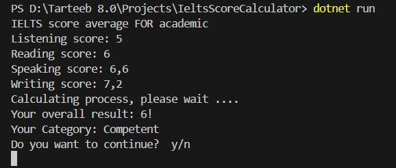

# IeltsScoreCalculator

## How to use this programm

It is easy to use who knows or hears about **IELTS**
Sizdan 4 ta narsani kiritish talab qilinadi.
ular quyidagilar:
-    _Listing score_
-    *Reading score*
-    *Speaking score*
-    *Writing score*

ma'lumotlarni kiritganingizdan keyin sizga umumiy o'rtacha ballni bir zumda hisoblab beradi.

> You can see some 

